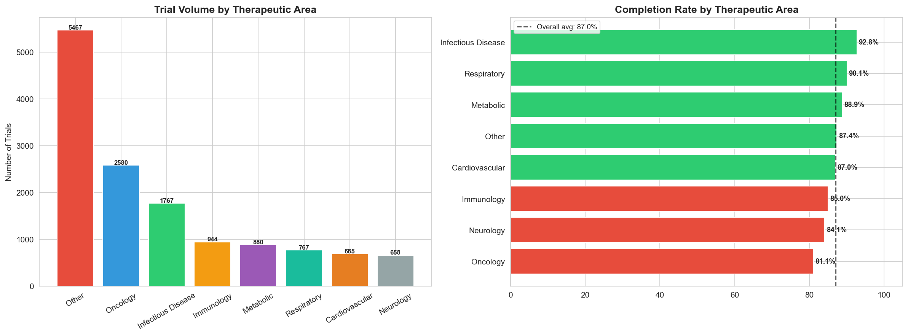
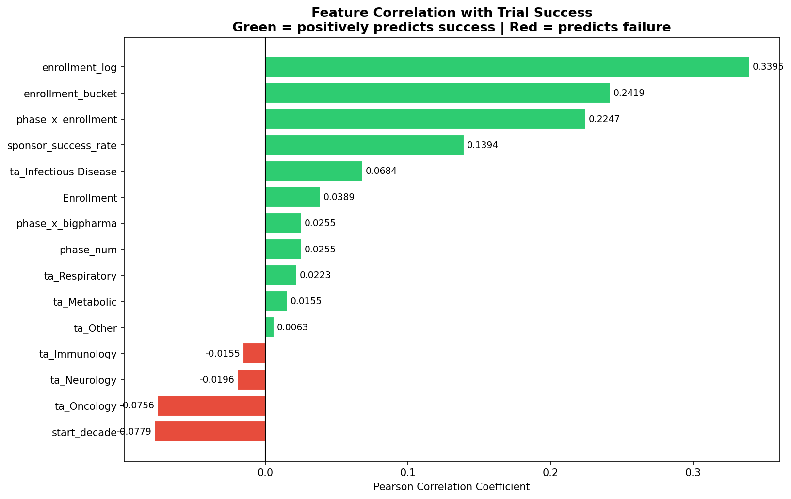
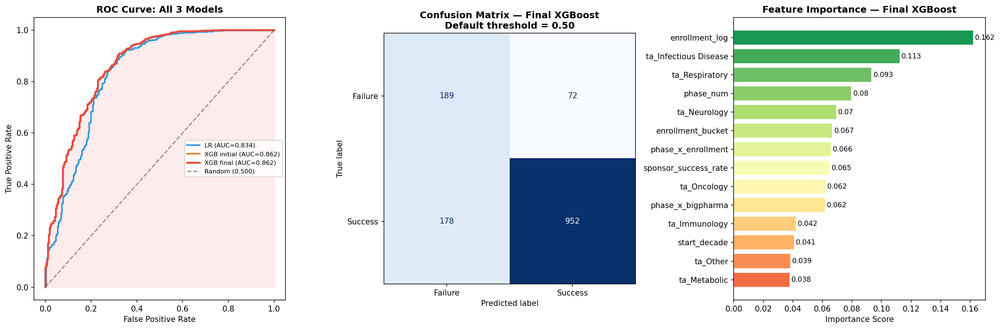
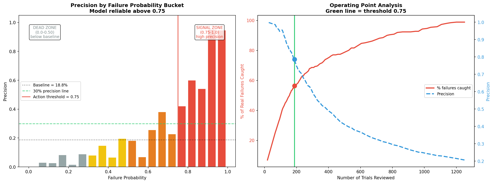
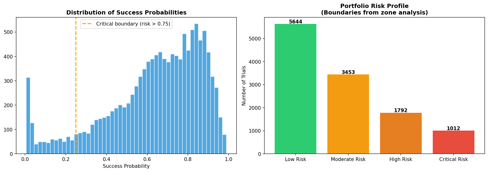
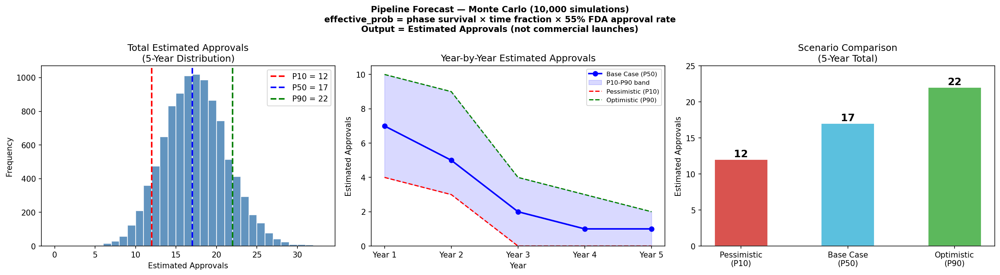

# Clinical Trial Portfolio Intelligence & Risk Forecasting Platform

A production-grade machine learning system for clinical trial termination risk scoring
and portfolio-level pipeline forecasting.

**Live Dashboard:** [https://clinical-trial-risk-forecasting-platform-qervhsm3asa5ts4jybqkf.streamlit.app/](https://clinical-trial-risk-forecasting-platform-qervhsm3asa5ts4jybqkf.streamlit.app/)

---

## Overview

Clinical trial termination represents a significant source of portfolio risk in
pharmaceutical development. Terminated studies consume clinical, operational, and
financial resources while reducing the probability of future approvals.

This platform addresses that problem through two complementary capabilities:

**Risk Scoring** — An XGBoost classifier trained on 9,541 historical clinical trials
predicts the probability of early termination for every active trial in the portfolio.
Trials exceeding the critical threshold are surfaced for immediate review.

**Pipeline Forecasting** — A Monte Carlo simulation (10,000 runs) combines
trial-level risk estimates with phase-specific progression assumptions to generate
P10, P50, and P90 approval outcome scenarios over a 5-year horizon.

Both outputs are delivered through a 4-page Streamlit executive dashboard with
SHAP-based explainability, therapeutic-area risk profiling, and scenario planning.

---

## Key Results

| Metric | Value |
|---|---|
| Model | XGBoost Classifier |
| Validation | Rolling Window Cross-Validation (4 windows) |
| Rolling Mean AUC | 0.842 +/- 0.036 |
| Test Set AUC | 0.862 |
| Critical Threshold Precision | 79% |
| Critical Threshold Recall | 56% |
| Trials Reviewed at 0.75 Threshold | 13% of pipeline |
| Active Trials Scored | 320 (Novartis) |
| 5-Year Forecast Range | P10=12, P50=17, P90=22 estimated pipeline outcomes |

---

## Methodology

### Data

- **Dataset:** AERO-BirdsEye-Data.csv — 13,748 clinical trials from 10 major sponsors (1984-2020)
- **Source:** [Kaggle — Clinical Trials Overview](https://www.kaggle.com/datasets/thedevastator/a-quick-overview-of-clinical-trials)
- **Training window:** 2005-2017 (9,541 trials after filtering)
- **Filtering rationale:** Pre-2005 data removed (noisy era, 0-7% failure rate). Post-2017 removed (fast-completing bias, 49% failure rate).
- **Target variable:** Trial completion status (Completed vs Terminated/Withdrawn)

The chart below shows completion rates across therapeutic areas, which informed
the therapeutic area one-hot encoding strategy.



*Oncology and Neurology show the lowest historical completion rates,
making therapeutic area a meaningful predictive feature.*

---

### Feature Engineering

14 features were engineered with strict attention to data leakage:

| Feature | Description |
|---|---|
| phase_num | Ordinal phase encoding (1-4) |
| enrollment_log | Log-transformed enrollment — strongest predictor (+0.34 correlation) |
| enrollment_bucket | Categorical enrollment size bucket |
| sponsor_success_rate | Time-aware historical completion rate per sponsor using shift(1).expanding().mean() — eliminates future leakage |
| start_decade | Era encoding to capture temporal decline in completion rates |
| phase_x_enrollment | Phase-enrollment interaction |
| phase_x_bigpharma | Phase-sponsor tier interaction |
| ta_* (7 columns) | One-hot encoded therapeutic area (Cardiovascular as reference) |

**Leakage prevention:** sponsor_success_rate uses a cumulative expanding mean with a
one-row shift, ensuring each trial sees only outcomes from trials that started before it.

The chart below shows Pearson correlation of each feature with the target variable,
validating that all 14 features contribute meaningful signal.



*enrollment_log is the strongest individual predictor (+0.34).
Oncology and start_decade are the strongest negative predictors — higher risk.*

---

### Model Training

Rolling window cross-validation was used to respect temporal ordering.
Each window trains exclusively on past data and evaluates on genuinely unseen future data —
the only honest approach for time-series clinical trial prediction.

| Window | Train | Test | AUC |
|---|---|---|---|
| Window 1 | 2005-2009 | 2010-2011 | 0.808 |
| Window 2 | 2005-2011 | 2012-2013 | 0.818 |
| Window 3 | 2005-2013 | 2014-2015 | 0.844 |
| Window 4 | 2005-2015 | 2016-2017 | 0.900 |
| **Mean** | | | **0.842 +/- 0.036** |

Final model uses XGBoost initial parameters (tuning did not improve test AUC —
a legitimate outcome indicating initial parameters were well-suited to this dataset).

The chart below shows model comparison, learning curves, and feature importance
from the final evaluation.



*Left: ROC curves for all three models. XGBoost achieves AUC 0.862 on the test set,
outperforming the Logistic Regression baseline (0.834) by 2.8 AUC points.*

---

### Risk Threshold Framework

The 0.75 operational threshold was discovered through zone analysis — not chosen manually.
Bucket-level precision analysis revealed a clear precision cliff at this point,
above which model precision rises reliably above the 18.8% baseline.



*Precision remains near-random below 0.75 and jumps to 42-95% above it.
This cliff was discovered from the data, not predetermined.*

| Threshold | Use Case | Trials Flagged | Precision | Recall |
|---|---|---|---|---|
| 0.30 | Portfolio Surveillance | 52% | 32% | 88% |
| 0.75 | Risk Review and Mitigation | 13% | 79% | 56% |
| 0.95 | Executive Escalation | 7% | 95% | 34% |

**Confusion matrix at 0.75 (test set):**

|  | Predicted At Risk | Predicted Safe |
|---|---|---|
| Actually Failed | 146 (TP) | 115 (FN) |
| Actually Completed | 39 (FP) | 1,091 (TN) |

Reviewing 13% of the pipeline at this threshold catches 56% of all genuine failures
with 79% precision — meaning 4 out of every 5 alerts raised are genuine risks.

---

### Risk Score Distribution

The chart below shows how risk scores distribute across all 11,901 scored trials,
confirming the model creates meaningful separation between completed and terminated trials.



*Most trials cluster in the low-to-moderate risk range. The critical risk population
above 0.75 represents 8.5% of all scored trials — consistent with the historical
13% termination rate adjusted for model confidence.*

---

### Monte Carlo Simulation

The simulation converts trial-level risk scores into portfolio-level outcome forecasts.

```
effective_probability = survival_probability x TIME_FRACTION

TIME_FRACTION:
  Phase 3: 0.40 (time) x 0.55 (FDA approval rate) = 0.22
  Phase 2: 0.08  (Phase 2 + Phase 3 + FDA within 5 years)
  Phase 1: 0.02  (all phases + FDA within 5 years)
```

The 55% FDA approval rate is applied as a post-processing assumption to Phase 3
completions — not as a model prediction. Outputs are labelled as estimated pipeline
outcomes, not direct approval predictions.

The chart below shows the full simulation output including year-by-year forecast,
phase contribution, and distribution across all 10,000 runs.



*P10=12, P50=17, P90=22 estimated pipeline outcomes. Phase 3 trials drive Years 1-2.
Years 3-5 reflect the pipeline dip as Phase 2 programs advance — a normal pharma cycle.*

---

### SHAP Explainability

TreeExplainer was applied to the XGBoost model on the test set.
Top 5 features by mean absolute SHAP value:

| Feature | Mean SHAP |
|---|---|
| Enrollment Size | 0.88 |
| Sponsor Track Record | 0.28 |
| Phase x Enrollment | 0.25 |
| Trial Phase | 0.24 |
| Start Decade | 0.18 |

Enrollment size is the dominant driver — large trials complete at significantly higher
rates than small trials, consistent with better funding, protocol design, and oversight.

---

## Project Structure

```
ClinicalEdge/
|
|-- data/
|   |-- AERO-BirdsEye-Data.csv          # Place dataset here
|
|-- src/
|   |-- config.py                        # All constants, thresholds, sponsor config
|   |-- logger.py                        # Terminal + timestamped file logging
|   |-- data_loader.py                   # Dataset loading and validation
|   |-- eda.py                           # 4 EDA charts
|   |-- feature_engineering.py           # 14 features, leakage-free encoding
|   |-- model_training.py                # Rolling CV, XGBoost, hyperparameter tuning
|   |-- evaluation.py                    # Threshold analysis, zone analysis, SHAP
|   |-- scoring.py                       # Risk scoring for finished and active trials
|   |-- simulation.py                    # Monte Carlo pipeline forecast
|
|-- dashboard/
|   |-- app.py                           # Streamlit 4-page dashboard
|
|-- outputs/                             # All charts and CSVs generated here
|-- logs/                                # Timestamped pipeline logs
|-- main.py                              # Master pipeline script
|-- requirements.txt
```

---

## Setup and Usage

### Prerequisites

Python 3.9 or higher is recommended.

### Installation

```bash
git clone https://github.com/your-username/clinicaledge.git
cd clinicaledge
pip install -r requirements.txt
```

### Dataset

Download `AERO-BirdsEye-Data.csv` from Kaggle and place it in the `data/` folder:

[https://www.kaggle.com/datasets/thedevastator/a-quick-overview-of-clinical-trials](https://www.kaggle.com/datasets/thedevastator/a-quick-overview-of-clinical-trials)

### Run Pipeline

```bash
python main.py
```

Expected runtime: approximately 60 seconds including SHAP computation.
All outputs saved to `outputs/`. Full log saved to `logs/`.

### Run Dashboard

```bash
streamlit run dashboard/app.py
```

Opens at `http://localhost:8501`

### Change Sponsor

To score a different sponsor, edit one line in `src/config.py`:

```python
DEPLOY_SPONSOR = 'Pfizer'   # Options: Novartis, Pfizer, Roche, JNJ, Merck, AbbVie, Sanofi, GSK
```

Re-run `python main.py` followed by `streamlit run dashboard/app.py`.

---

## Dashboard Pages

### Home

Project introduction, business problem, ML pipeline overview, dataset summary,
and model performance reference.

### Executive Portfolio Overview

Portfolio-wide risk indicators, actionable risk trial counts, highest risk phase,
executive action panel, SHAP-driven risk driver analysis, and therapeutic area
risk profiling table.

### Active Trial Monitor

Trial-level risk monitoring with filterable critical risk table, phase-level risk
rate breakdown, priority score (risk x log enrollment), and risk concentration
by therapeutic area.

### Portfolio Forecast and Scenario Planning

P10/P50/P90 scenario KPIs, year-by-year expected approval chart, phase contribution
breakdown, simulation distribution across 10,000 runs, and forecast methodology note.

---

## Known Limitations

**Target variable:** The model predicts trial completion (Completed vs Terminated),
not FDA regulatory approval. A 55% historical FDA approval rate is applied as a
correction to Phase 3 completions in the simulation. True fix requires linking
to FDA Orange Book records.

**Single model across phases:** Phase 1, 2, and 3 fail for different reasons
(safety, efficacy, scale respectively). Three phase-specific models would be
more precise. The current model uses phase interaction features as a partial substitute.

**Sponsor scope:** Training data covers 10 major sponsors only. Sponsor success rate
feature is less reliable for smaller or unknown sponsors.

**Dataset snapshot:** Active trials represent a 2019 snapshot from the dataset.
A production deployment would connect to the live ClinicalTrials.gov API.

---

## Technical Stack

| Component | Technology |
|---|---|
| ML Model | XGBoost 1.7+ |
| Explainability | SHAP (TreeExplainer) |
| Data Processing | Pandas, NumPy |
| Visualisation | Matplotlib, Seaborn, Plotly |
| Dashboard | Streamlit |
| Validation | scikit-learn (rolling window CV) |
| Simulation | NumPy Monte Carlo (10,000 runs) |

---

## License

This project is for educational and portfolio purposes.
Dataset is sourced from Kaggle under public availability terms.
